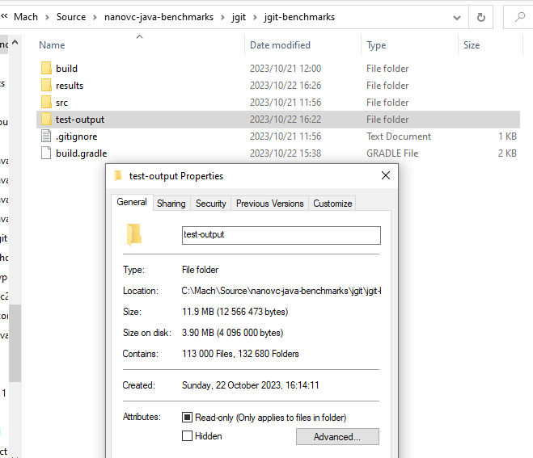

The jgit performance test requires the following disk space to execute:

| Property          | Amount     | Units       |
|-------------------|------------|-------------|
| Size              | 12 566 473 | Bytes       |
| Size (MB)         | 11.9       | MB          |
| Size on Disk      | 4 096 000  | Bytes       |
| Size on Disk (MB) | 3.90       | MB          |
| Files             | 113 000    | Files       |
| Directories       | 132 680    | Directories |
